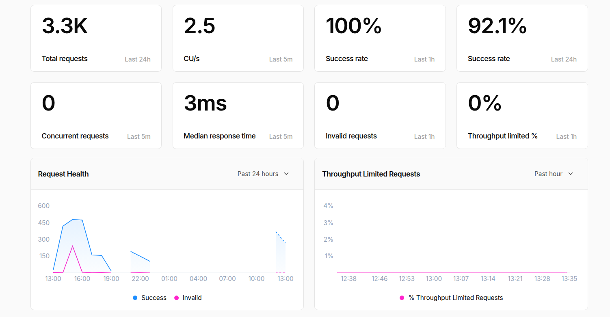

# 🏠 Blockchain Smart Contracts - Real Estate Rental dApp

## 📋 Overview

This repository contains the blockchain layer of a decentralized real estate rental platform built on Ethereum. The smart contracts enable peer-to-peer property listings and leasing with secure, transparent, and intermediary-free transactions using Solidity and Hardhat.

## 🏗️ Architecture

The blockchain layer implements a microservices architecture with three core contracts:

### 📦 Core Contracts

#### 1. **PropertyRegistry.sol**
- **Purpose**: Central registry for all real estate properties
- **Key Features**:
  - Property registration with metadata (price, deposit, IPFS hash)
  - Property status management (AVAILABLE, LOCKED, BOOKED)
  - Owner verification and access control
  - Gas-optimized storage patterns

#### 2. **Escrow.sol**
- **Purpose**: Secure payment handling and fund management
- **Key Features**:
  - Multi-signature escrow for rental payments
  - Security deposit management
  - Automatic fund release conditions
  - Reentrancy protection

#### 3. **Booking.sol**
- **Purpose**: Complete booking lifecycle management
- **Key Features**:
  - Booking creation and validation
  - Payment processing integration
  - Status tracking (PENDING → CONFIRMED → COMPLETED)
  - Cancellation and refund logic
  - Date validation and pricing calculations

## 🔧 Technology Stack

- **Smart Contracts**: Solidity v0.8.28
- **Development Framework**: Hardhat v2.26.3
- **Security Libraries**: OpenZeppelin Contracts v4.9.6
- **Testing**: Chai + Hardhat
- **TypeScript**: Full type safety with TypeChain
- **Security Tools**: Slither integration
- **Gas Optimization**: Hardhat Gas Reporter

## 🚀 Quick Start

### Prerequisites
```bash
npm -v && node -v  # Node.js v18.x+
```

### Installation
```bash
# Clone repository
git clone https://github.com/EthProjectImmobilier/Block-chain.git
cd Block-chain

# Install dependencies
npm install

# Copy environment template
cp .env.example .env
```

### Environment Setup
Create `.env` file with:
```env
ALCHEMY_API_URL=https://eth-sepolia.g.alchemy.com/v2/YOUR_API_KEY
PRIVATE_KEY=your_private_key_here
ETHERSCAN_API_KEY=your_etherscan_api_key
```

### Local Development
```bash
# Start local Hardhat network
npx hardhat node

# Deploy contracts (new terminal)
npx hardhat run scripts/deploy.ts --network localhost

# Run tests
npx hardhat test

# Gas usage report
REPORT_GAS=true npx hardhat test
```

## 📊 Contract Interactions

### Property Registration
```solidity
// Add property to registry
uint256 propertyId = propertyRegistry.addProperty(
    100000000000000000, //  ETH per night
    200000000000000000, //  ETH security deposit
    bytes32(ipfsHash)    // Property metadata hash
);
```

### Booking Process
```solidity
// Create booking
uint256 bookingId = booking.createBooking(
    propertyId,
    startDate,
    endDate,
    bookingDataHash
);

// Confirm with payment
booking.confirmBooking{value: totalAmount}(bookingId);
```

### Completion & Payouts
```solidity
// Complete rental and release funds
booking.completeBooking(bookingId);
// Automatically releases:
// - Rent to property owner
// - Security deposit to tenant
```

## 🔒 Security Features

### Implemented Protections
- ✅ **ReentrancyGuard**: All state-changing functions
- ✅ **Access Control**: Owner-only modifiers
- ✅ **Input Validation**: Date ranges, pricing, addresses
- ✅ **Integer Overflow**: Solidity 0.8+ built-in protection
- ✅ **Pull-over-Push**: Safe fund transfers via Address.sendValue

### Security Audits
```bash
# Run Slither static analysis
slither contracts/


# Coverage report
npx hardhat coverage
```

## 📈 Gas Optimization

### Optimizations Implemented
- **Storage Packing**: uint128 for prices to save slots
- **Immutable Variables**: Contract addresses stored once
- **Events**: Off-chain data storage for UI
- **Minimal External Calls**: Optimized escrow interactions


## 🌐 Network Deployment

### RPC Node Performance
Our RPC node demonstrates excellent performance metrics:



- **Total Requests**: 3.3K (Last 24h)
- **Compute Units per Second**: 2.5 CU/s (Last 5m)  
- **Success Rate**: 100% (Last 1h) / 92.1% (Last 24h)
- **Median Response Time**: 3ms (Last 5m)
- **Zero Invalid Requests**: 0 (Last 1h)
- **No Throughput Limiting**: 0% (Last 1h)

### Testnet (Sepolia)
```bash
npx hardhat run scripts/deploy.ts --network sepolia
```

### Contract Addresses (Sepolia)
```
PropertyRegistry: 0xC7A3D20A9a23Ef10FE4F4B7c302e2b8B46172427
Escrow:          0xcb12037162B776b2DDd3Cd613C50353275AaE53c
Booking:         0xD1c004fa1B660ed71818f2403EE679B008C81E42
```

### Verification
```bash
npx hardhat verify --network sepolia <contract-address> <constructor-args>
```

## 🧪 Testing Strategy

### Test Coverage
- ✅ Unit tests for all contract functions
- ✅ Integration tests for contract interactions
- ✅ Edge cases and error conditions
- ✅ Gas optimization tests
- ✅ Security vulnerability tests

### Running Tests
```bash
# Full test suite
npx hardhat test


# Coverage report
npx hardhat coverage
```

## 🔗 Frontend Integration

### Contract ABIs
Generated ABIs are available in `artifacts/contracts/` for frontend integration.

### Web3 Integration Example
```javascript
// Connect to contracts
const propertyRegistry = new ethers.Contract(
    addresses.PropertyRegistry,
    abi.PropertyRegistry,
    signer
);

// Add property
const tx = await propertyRegistry.addProperty(
    ethers.parseEther("0.1"),
    ethers.parseEther("0.2"),
    ethers.id("ipfs://Qm...")
);
```

## 📁 Project Structure

```
contracts/
├── PropertyRegistry.sol    # Property management
├── Escrow.sol              # Payment escrow
└── Booking.sol             # Booking lifecycle

scripts/
└── deploy.ts               # Deployment script


hardhat.config.ts           # Hardhat configuration
package.json               # Dependencies
.env                       # Environment variables
```

## 🎯 Role: Blockchain Engineer

As the Blockchain Engineer on this 5-person team, my responsibilities included:

- ✅ **Smart Contract Development**: Designed and implemented 3 core contracts
- ✅ **Security Implementation**: Integrated OpenZeppelin libraries and best practices
- ✅ **Gas Optimization**: Optimized storage patterns and function calls
- ✅ **Testing Strategy**: Comprehensive test suite with >90% coverage
- ✅ **Deployment Pipeline**: Automated deployment to Sepolia testnet
- ✅ **Web3 Integration**: Provided ABIs and integration examples for frontend team
- ✅ **Documentation**: Technical documentation for cross-team collaboration


## 📞 Support & Contact

For technical questions or collaboration:
- **GitHub Issues**: Report bugs and feature requests
- **Technical Documentation**: See inline code comments
- **Team Collaboration**: Coordinate with Backend, Frontend, Cloud, and DevOps engineers

---

**Built with the Team**  
*Part of the Decentralized Real Estate Rental Platform RentChain*
