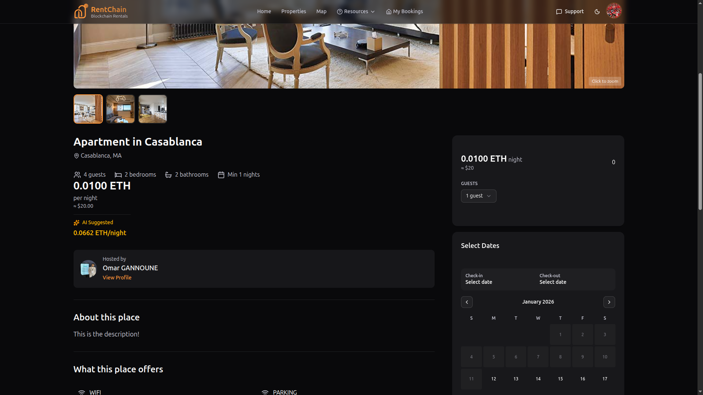
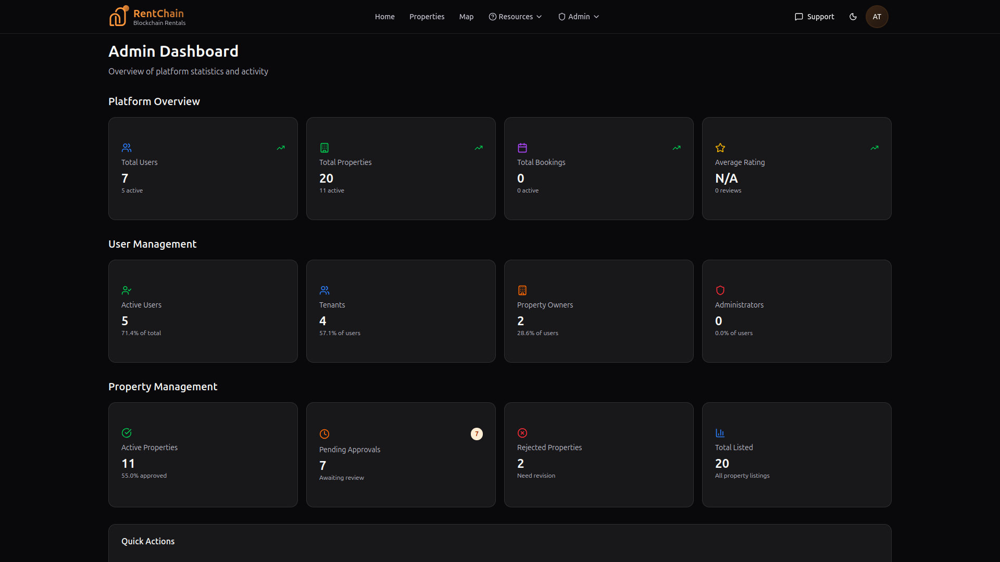
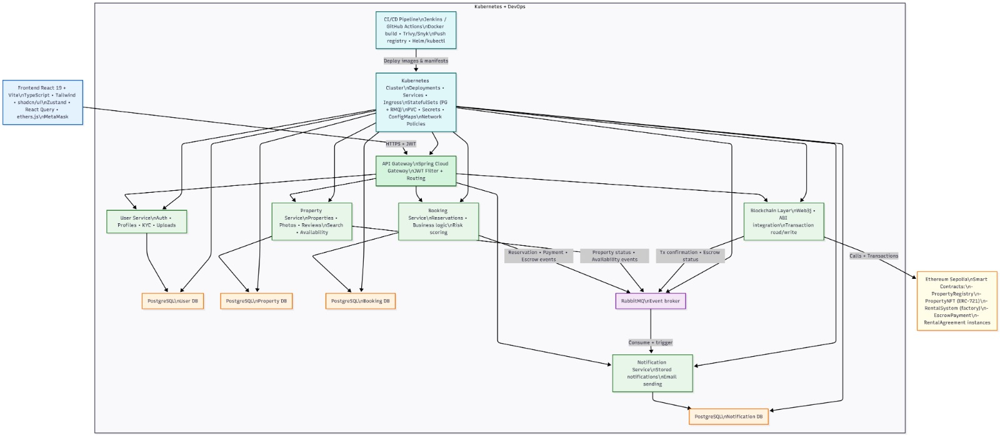
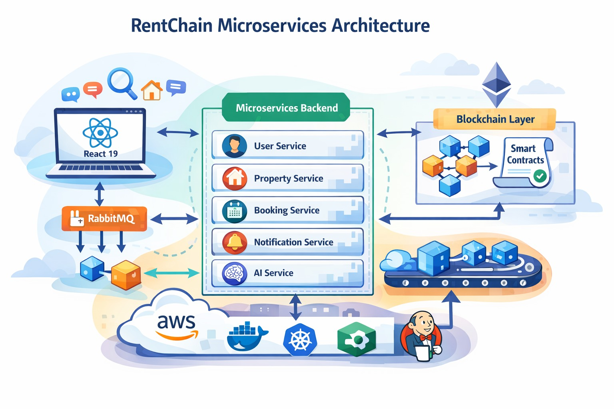

# 🏠 RentChain
## Plateforme Décentralisée de Location Immobilière

### Home Page

*Main landing page with featured properties and market trends*

### Property Details

*Detailed property view with booking interface*

### Admin Panel

*Administrative dashboard for platform management*

<blockquote>
<strong>Une DApp Web3 complète pour la location immobilière sans intermédiaire, bâtie sur Ethereum Sepolia</strong>
</blockquote>

 

  

---

## 📋 Résumé du Projet

**RentChain** est une plateforme Web3 décentralisée de location immobilière, inspirée d'Airbnb, construite sur la blockchain Ethereum (Sepolia testnet). Le projet démontre l'intégration complète de technologies modernes :

<table>
<tr>
<td width="50%">

**⛓️ Blockchain**
Smart contracts Solidity pour transactions transparentes et sécurisées

</td>
<td width="50%">

**🔧 Backend**
Architecture microservices Spring Boot avec 6 services indépendants

</td>
</tr>
<tr>
<td width="50%">

**🎨 Frontend**
Interface React 19 moderne avec intégration MetaMask

</td>
<td width="50%">

**🤖 Intelligence Artificielle**
Modèles ML pour recommandations et tarification dynamique

</td>
</tr>
<tr>
<td colspan="2" style="text-align: center;">

**☁️ DEVOPS**
Déploiement conteneurisé avec Docker, Kubernetes,Jenkins CI/CD

</td>
</tr>
</table>

### 👥 Rôles des Utilisateurs

<strong>👤 Visiteur</strong> 
Navigation, recherche et consultation des propriétés

<strong>🏠 Locataire</strong> 
Réservation sécurisée, paiement via MetaMask

<strong>🏢 Propriétaire</strong> 
Création d'annonces, gestion, suivi revenus

<strong>⚙️ Administrateur</strong> 
Modération, gestion utilisateurs, analytics

---

## ✨ Fonctionnalités Principales

<h3>🔎 Recherche Avancée</h3>
Filtres temps réel (prix, dates, localisation), carte interactive, favoris

<h3>💳 Paiements Web3</h3>
MetaMask + smart contracts avec escrow sécurisé

<h3>🏢 Gestion d'Annonces</h3>
Création, édition, calendrier, suivi revenus

<h3>⚡ Communications Temps Réel</h3>
RabbitMQ asynchrone, emails SMTP, notifications

<h3>🤖 IA Intégrée</h3>
Recommandations, prévisions XGBoost, risk scoring

<h3>🔐 Sécurité Avancée</h3>
JWT, OpenZeppelin, ReentrancyGuard, validations

---

## 🏗️ Architecture Système

L'application repose sur une **architecture microservices orientée événements** :

Avec un exemple illustrateur 

<h2>🛠️ Stack Technologique</h2>

<table width="100%" cellpadding="10">

<tr>
<th>Domaine</th>
<th>Technologies</th>
</tr>

<tr>
<td><b>Backend</b></td>
<td align="center">
    
    
    
    
    
</td>
</tr>

<tr>
<td><b>Frontend</b></td>
<td align="center">
    
    
    
    
    
</td>
</tr>

<tr>
<td><b>Blockchain</b></td>
<td align="center">
    
    
    
    
</td>
</tr>

<tr>
<td><b>IA / ML</b></td>
<td align="center">
    
    
    
    
</td>
</tr>

<tr>
<td><b>DevOps</b></td>
<td align="center">
    
    
    
    
</td>
</tr>
<tr>
<td><b>Cloud</b></td>
<td align="center">
    
    
    
</td>
</tr>

</table>

 

<h2>👥 Les rôles et responsables</h2>

<table align="center" width="100%" cellpadding="10">
<tr>
    <th>Rôle</th>
    <th>Responsable</th>
    <th>Technologie</th>
    <th>Documentation</th>
</tr>

<tr align="center">
    <td>Backend</td>
    <td><b>Marouane Faik</b></td>
    <td>
        
        
    </td>
    <td><a href="./Backend/Backend.md">README</a></td>
</tr>

<tr align="center">
    <td>Frontend</td>
    <td><b>Omar GANNOUNE</b></td>
    <td>
        
        
    </td>
    <td><a href="./rentChain/README.md">README</a></td>
</tr>

<tr align="center">
    <td>Blockchain</td>
    <td><b>Chikh Imane</b></td>
    <td>
        
        
    </td>
    <td><a href="./Block-chain/README.md">README</a></td>
</tr>

<tr align="center">
    <td>DevOps</td>
    <td><b>Salah Eddine Khazri</b></td>
    <td>
        
        
        
    </td>
    <td><a href="./K8s/DevOps.md">README</a></td>
</tr>

<tr align="center">
    <td>Cloud</td>
    <td><b>Youssef El Ajbari</b></td>
    <td>
        
        
    </td>
    <td><a href="./K8s/Cloud.md">README</a></td>
</tr>

<tr align="center">
    <td>Intelligence Artificielle</td>
    <td><b>Marouane Faik</b></td>
    <td>
        
        
    </td>
    <td><a href="./ia_service/README.md">README</a></td>
</tr>

</table>
