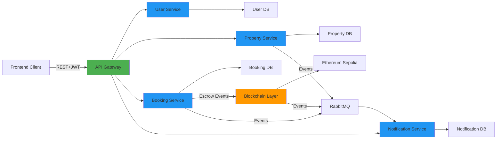

<div align="center">

  <h1>RentChain · Backend Microservices</h1>

  <p>
    Backend d’une dapp de location immobilière moderne,<br/>
    construit autour de <b>microservices Spring Boot</b> sécurisés par JWT<br/>
    et intégrés à une <b>blockchain Ethereum</b> pour la gestion des paiements et de l’escrow.
  </p>

</div>

---

<div align="center">
  <h3>Tech Stack</h3>
  <p>
    
  </p>
  <p><small>Backend : Spring Boot · Sécurité : JWT · Asynchronous Messaging : RabbitMQ · DB : PostgreSQL</small></p>
</div>

---
## 👤 Auteur & Contacts

<div align="center">
  <p>Réalisé par <b>FAIK MAROUANE</b></p>
  <p>
    <a href="https://github.com/marouanof" target="_blank" rel="noreferrer">
      
    </a>
  </p>
</div>

---

## Architecture backend



Chaque microservice possède sa propre base de données, sa configuration, et communique principalement via **REST** (via la gateway) et **RabbitMQ** pour les événements.

---

## 2. Microservices et responsabilités

| Service            | Dossier            | Port (par défaut) | Rôle principal |
|--------------------|--------------------|-------------------|----------------|
| API Gateway        | `gateway/`         | 8080              | Point d’entrée unique, routage, filtrage JWT, délégation vers les microservices |
| User Service       | `user-service/`    | 8081              | Authentification, gestion utilisateurs, profils, rôles, fichiers KYC & avatars |
| Property Service   | `property-service/`| 8082              | Propriétés, images, disponibilité, reviews, recherche, analytics |
| Booking Service    | `booking-service/` | 8083              | Réservations, cohérence des états, gestion du risque, intégration blockchain |
| Notification Serv. | `notification-service/` | 8086         | Notifications persistées, emails, consommation d’événements RabbitMQ |
| Blockchain Layer   | `Blockchain_Layer/`| 8085              | Intégration Ethereum/Sepolia, escrow, vérification des paiements, événements |

---

## 3. Mon travail en tant que développeur backend

### 3.1. Architecture & communication
- Conception de l’**architecture microservices** autour de domaines métier clairs : utilisateurs, propriétés, réservations, notifications, blockchain.
- Mise en place de la **API Gateway** (Spring Cloud Gateway) avec routage dynamique, filtres custom (`JwtAuthenticationFilter`), et propagation des informations utilisateur.
- Définition des **contrats REST** (DTO, conventions d’URL, statuts HTTP, gestion d’erreurs centralisée) pour chaque service.
- Utilisation de **RabbitMQ** pour les événements asynchrones (réservations créées/annulées, notifications, événements blockchain, etc.).

### 3.2. Sécurité & identité
- Mise en place de l’**authentification JWT** (génération, validation, refresh) dans `user-service` et intégration dans la gateway.
- Gestion des **rôles et permissions** (TENANT, OWNER, ADMIN) et des routes publiques / protégées.
- Création de filtres et endpoints internes pour la **communication inter-service sécurisée**.

### 3.3. Services métier
- **User Service** :
  - APIs d’inscription, login, refresh, reset password, gestion du profil.
  - Gestion des **fichiers utilisateurs** (avatars, KYC recto/verso), stockage local dans `uploads/` (et préparation pour S3 via `S3Config` et un `FileStorageService`).
  - Vérification d’email, association de **wallet Ethereum**, endpoints internes pour les autres services.

- **Property Service** :
  - APIs de **CRUD propriétés**, recherche avancée, gestion de la disponibilité et des images.
  - Gestion des **reviews** (création, modération admin, statistiques) et d’**analytics** (exposition des données au frontend ou à l’IA).
  - Intégration avec le user-service pour enrichir les réponses (propriétaires, profils, etc.).

- **Booking Service** :
  - APIs de **création, modification, annulation et consultation des réservations**.
  - Gestion de l’état des réservations (confirmed, completed, cancelled…) et validation métier.
  - Intégration avec **property-service** et **user-service** via clients HTTP.
  - Production d’événements pour la blockchain (escrow) et les notifications.

- **Notification Service** :
  - Stockage des notifications utilisateur (PostgreSQL), listing, marquage comme lues, suppression.
  - Envoi d’**emails** via SMTP.
  - Consommation des messages RabbitMQ émis par booking/property/blockchain.

- **Blockchain Layer** :
  - Intégration avec Ethereum/Sepolia via **Web3j**.
  - Gestion des smart contracts **Escrow**, **PropertyRegistry** (dossiers `solidity/` et `abis/`).
  - Endpoints pour **enregistrer des utilisateurs**, vérifier et suivre les paiements de réservation, lire les soldes d’escrow.
  - Listeners d’événements blockchain et publication d’événements vers les autres services (RabbitMQ).

---

## 4. Détails par service (résumé technique)

### 4.1. Gateway – [gateway/](gateway)
- **Technos** : Spring Boot, Spring Cloud Gateway, JWT.
- **Responsabilités** :
  - Routage vers les microservices (`GatewayRoutes.java`).
  - Validation des tokens (`JwtAuthenticationFilter`, `JwtTokenProvider`).
  - Définition des routes publiques/privées et propagation des headers utilisateur.

### 4.2. User Service – [user-service/](user-service)
- **Technos** : Spring Boot (Web, Security, Data JPA, Mail), PostgreSQL, Web3j, Lombok.
- **Responsabilités** :
  - Authentification JWT, refresh tokens, gestion de session côté backend.
  - Gestion des profils, avatars, fichiers KYC.
  - Rôles, permissions, endpoints admin, endpoints internes.

### 4.3. Property Service – [property-service/](property-service)
- **Technos** : Spring Boot (Web, Data JPA, Validation, AMQP), PostgreSQL, Lombok.
- **Responsabilités** :
  - CRUD propriétés, filtres de recherche, pagination.
  - Gestion des images et stockage dans `uploads/`.
  - Reviews, analytics, intégration RabbitMQ.

### 4.4. Booking Service – [booking-service/](booking-service)
- **Technos** : Spring Boot (Web, Data JPA, Validation, AMQP, OpenFeign), PostgreSQL.
- **Responsabilités** :
  - Modèle de réservation central du système.
  - Communication avec user-service et property-service via clients HTTP.
  - Gestion des erreurs métier spécialisées (conflits de réservation, profils incomplets, etc.).

### 4.5. Notification Service – [notification-service/](notification-service)
- **Technos** : Spring Boot (Web, Data JPA, AMQP, Mail, OpenFeign), PostgreSQL, RabbitMQ.
- **Responsabilités** :
  - Stockage et exposition des notifications.
  - Envoi d’emails selon les événements reçus.

### 4.6. Blockchain Layer – [Blockchain_Layer/](Blockchain_Layer)
- **Technos** : Spring Boot (Web, Validation, AMQP, OpenFeign), Web3j, RabbitMQ.
- **Responsabilités** :
  - Intégration avec les smart contracts (Escrow, PropertyRegistry) via les classes générées dans `abi/`.
  - Exposition d’APIs pour la création de locations blockchain, la vérification des transactions et la consultation des soldes.

---

## 5. Communication, persistance et fichiers

- **REST + JSON** : communication synchronisée entre les services via la gateway.
- **RabbitMQ** : événements métier (réservations, paiements, notifications, blockchain).
- **Bases de données** : chaque microservice possède son propre schéma (approche microservices réelle).
- **Fichiers** :
  - Avatars & KYC dans `user-service/uploads/`.
  - Documents & images de propriétés dans `property-service/uploads/`.
  - Architecture prête pour une migration vers **S3** via les configs déjà présentes.

---

## 6. Lancer le backend en local

### 6.1. Prérequis globaux
- Java 21+ (Java 17+ pour certains services comme Blockchain_Layer).
- Maven.
- PostgreSQL (une base par service, ou schémas séparés).
- RabbitMQ.

### 6.2. Démarrage des microservices Java
Depuis chaque dossier de service (`gateway/`, `user-service/`, `property-service/`, `booking-service/`, `notification-service/`, `Blockchain_Layer/`) :

```bash
mvn clean package
java -jar target/<nom-du-jar>.jar
```

Les ports par défaut sont listés dans les README de chaque service et dans leurs fichiers `application.yml` / `application.properties`.

## 7. Technologies clés

- **Langages** : Java (Spring Boot).
- **Frameworks** : Spring Boot, Spring Cloud Gateway, Spring Security.
- **Messaging** : RabbitMQ.
- **Base de données** : PostgreSQL (JPA/Hibernate).
- **Blockchain** : Web3j, smart contracts Solidity (Escrow, PropertyRegistry, etc.).
- **Infra** : Profils Spring, configuration via variables d’environnement / fichiers `.env`.


Ce README présente le travail backend réalisé autour de cette architecture microservices et de l’intégration blockchain, dans un contexte proche d’une application de production moderne.
